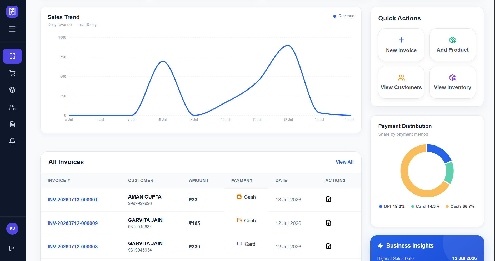
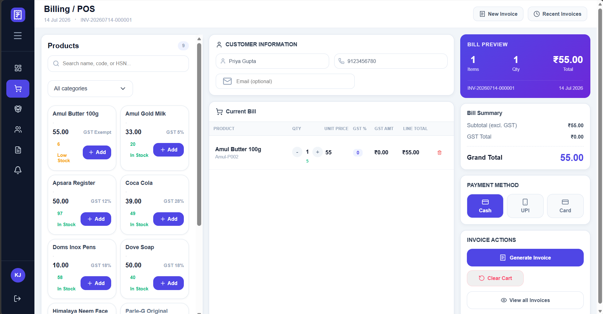
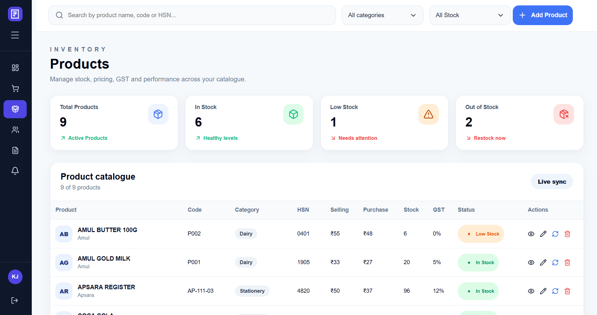
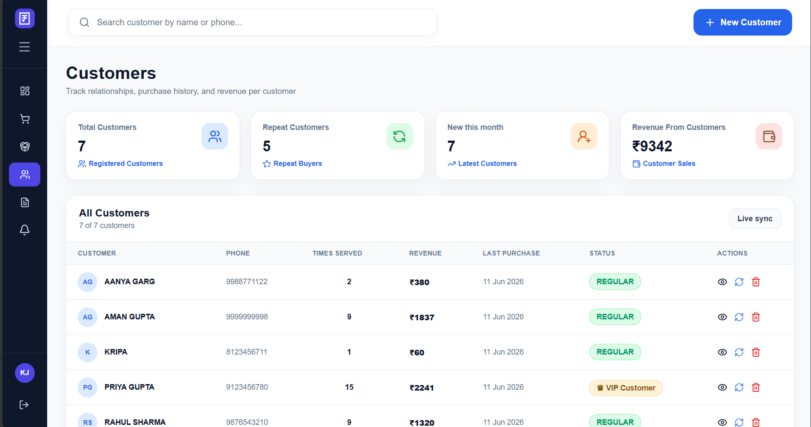
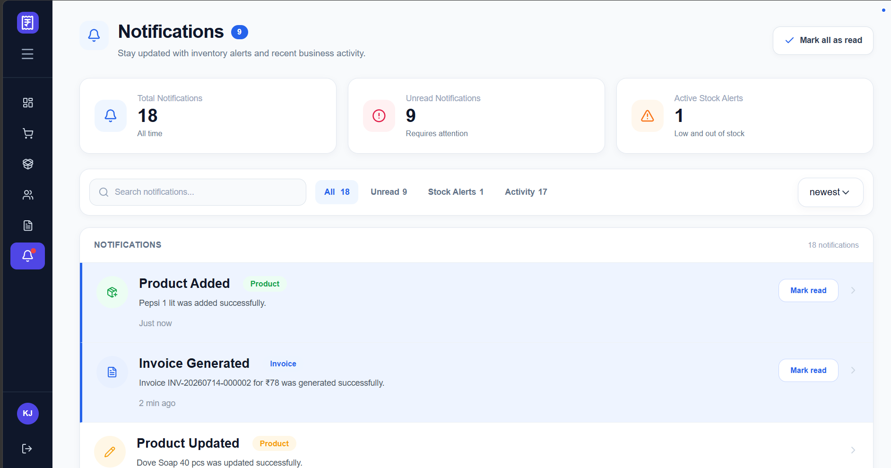
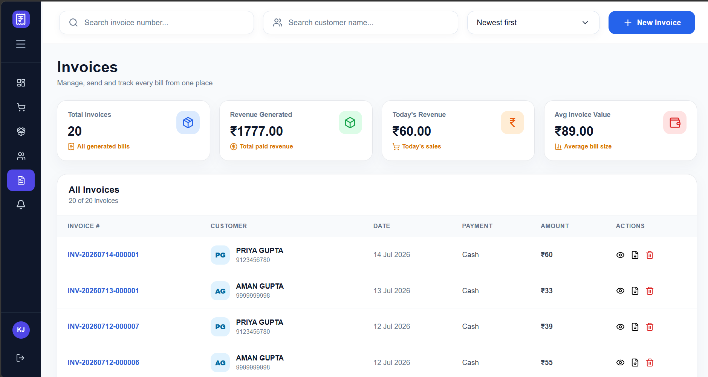
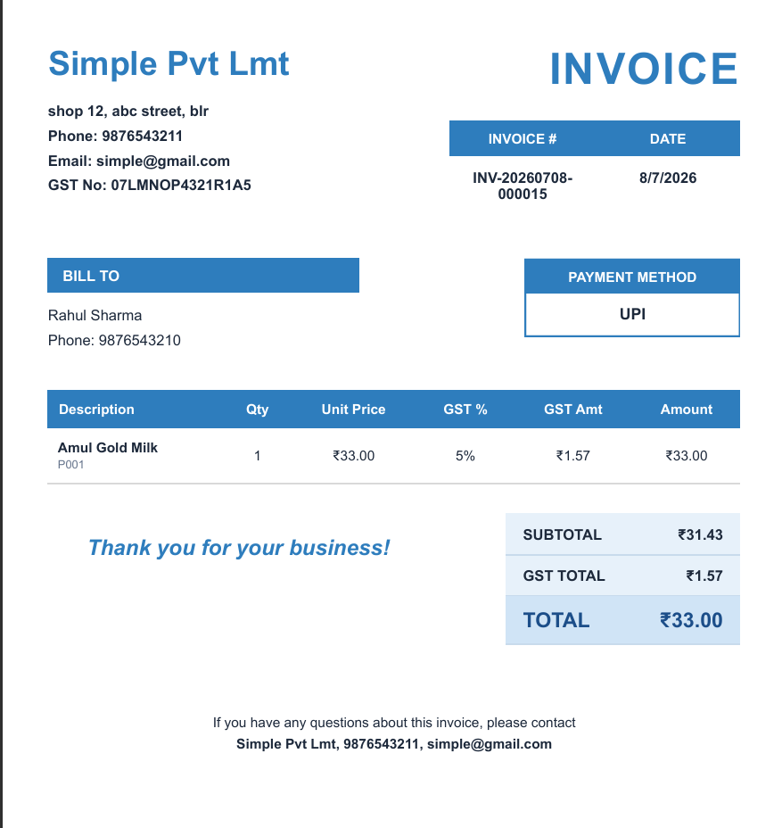
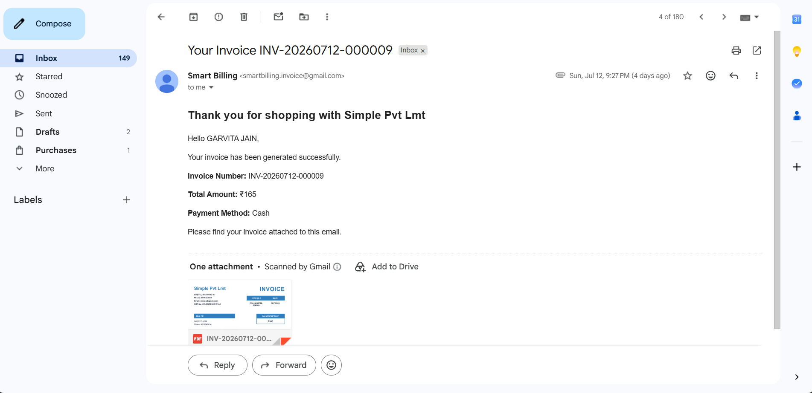

# 🧾 Smart Billing & Business Analytics System (MERN POS)

A full-stack **MERN-based Point of Sale (POS) & Business Analytics Platform** designed for small and medium-sized businesses to efficiently manage **billing, inventory, customers, invoices, and business analytics** from a single dashboard.

The platform automates invoice generation, GST calculation, inventory tracking, customer management, PDF invoice generation, email delivery, and provides real-time business insights through an intuitive analytics dashboard.

---

# ✨ Key Highlights

- 🚀 End-to-end Point of Sale (POS) system built using the MERN stack
- 🧾 Automated GST-compliant invoice generation with HSN code integration
- 📦 Intelligent inventory management with automatic stock updates, low-stock alerts, and     dead-stock detection
- 📄 PDF invoice generation with Cloudinary storage and automated pdf delivery via Resend
- 📊 Interactive analytics dashboard with revenue, profit, inventory, and customer insights
- 🔐 Secure JWT authentication using HTTP-only cookies
- ⚡ Responsive UI powered by React, Redux Toolkit, and RESTful APIs
- ☁️ Fully deployed MERN application with cloud-hosted backend and frontend

---

# 🚀 Features

## 🧾 Smart Billing System

- Create invoices in seconds
- Automatic GST calculation
- HSN code & GST rate integration
- Multiple payment methods (Cash, Card, UPI)
- Customer selection during billing
- Professional GST-compliant invoice generation

---

## 📄 Invoice Management

- Generate professional PDF invoices
- Download invoices anytime
- Secure cloud-based PDF storage using Cloudinary
- View complete invoice history
- Instantly email PDF invoices to customers using Resend
- Invoice PDF generation using Puppeteer and EJS templates

---

## 📦 Inventory Management

- Add, update, and delete products
- Product categorization
- Automatic stock deduction after every sale
- Real-time inventory valuation
- Product-wise sales tracking
- Purchase & selling price management
- Automatic HSN-based GST detection

---

## 🔔 Smart Notification System

- Low Stock Alerts
- Out of Stock Alerts
- Dead Stock Detection
- Product Added Notifications
- Product Updated Notifications
- Invoice Generated Notifications
- Mark individual or all notifications as read

---

## 📊 Business Analytics Dashboard

- Revenue Overview
- Profit Analysis
- Sales Trends
- Business Health Metrics
- Inventory Value
- Payment Method Distribution
- Top Selling Products
- Recent Invoices
- Customer Analytics & Growth Insights
- Highest Sales Day
- Average Invoice Value

---

## 👥 Customer Management

- Customer purchase history
- Customer revenue tracking
- Average order value
- Repeat customer identification
- Customer insights dashboard
- One-click invoice generation for existing customers

---

## 🔐 Authentication & Security

- JWT Authentication
- HTTP-only Cookie Authentication
- Protected Routes
- Password Hashing using bcrypt
- Express Validator
- Authentication Middleware
- Centralized Error Handling

---

## ⚡ Additional Highlights

- Automatic inventory updates after billing
- Responsive and modern dashboard UI
- RESTful API architecture
- Modular backend architecture
- Centralized state management using Redux Toolkit
- MongoDB Aggregation Framework for analytics
- Async request handling
- Scalable folder structure


---

# 🛠 Tech Stack

## Frontend

- React.js
- Redux Toolkit
- React Router DOM
- Vite
- CSS3
- Lucide React
- Fetch API

---

## Backend

- Node.js
- Express.js
- MongoDB
- Mongoose
- JSON Web Token (JWT)
- JWT Authentication
- bcrypt
- Cookie Parser
- Express Validator
- Nodemailer/Resend
- Puppeteer
- EJS
- Cloudinary
- Multer
- dotenv
- CORS

---

## Database

- MongoDB

---

# 📂 Project Structure

```text
Smart-Billing-System/
│
├── backend/
│   ├── public/
│   ├── src/
│   │   ├── config/
│   │   ├── controllers/
│   │   ├── middlewares/
│   │   ├── models/
│   │   ├── routes/
│   │   ├── utils/
│   │   └── app.js
│   │
│   ├── views/
│   │   └── invoice.ejs
│   │
│   ├── package.json
│   └── server.js
│
├── frontend/
│   ├── public/
│   ├── src/
│   │   ├── app/
│   │   ├── assets/
│   │   ├── components/
│   │   ├── features/
│   │   ├── pages/
│   │   ├── services/
│   │   ├── App.jsx
│   │   └── main.jsx
│   │
│   ├── package.json
│   └── vite.config.js
│
├── screenshots/
├── README.md
└── .gitignore
```

> **Note:** The `.env` file is excluded from version control and must be created manually.

---

# 🌐 Live Demo

Frontend:
https://smart-billing-business-analytics-sy.vercel.app
Backend API:
https://smart-billing-business-analytics-system.onrender.com

---

# 📸 Screenshots

You can find all the screenshots inside the **screenshots/** folder.

## Dashboard



## Billing



## Products



## Customers



## Notifications



## Invoices



## Generated Invoice PDF



## Invoice Email Delivery




---

# ⚙️ Installation

## 1. Clone the Repository

```bash
git clone https://github.com/garvitajain1307-art/smart-billing-business-analytics-system.git
```

## 2. Navigate to the Project

```bash
cd smart-billing-business-analytics-system
```

## 3. Install Backend Dependencies

```bash
cd backend
npm install
```

## 4. Install Frontend Dependencies

```bash
cd ../frontend
npm install
```

---

# 🔑 Environment Variables

Create a **backend/.env** file and add the following variables:

```env


PORT=

MONGO_URI=

JWT_SECRET=

FRONTEND_URL=

RESEND_API_KEY=
EMAIL_FROM=

CLOUDINARY_CLOUD_NAME=
CLOUDINARY_API_KEY=
CLOUDINARY_API_SECRET=
```

Create a **frontend/.env** file and add the following variables:

```env


VITE_BACKEND_URL=

```

---

# ▶️ Running the Project

Open **two terminals**.

### Terminal 1 (Backend)

```bash
cd backend
npm run dev
```

### Terminal 2 (Frontend)

```bash
cd frontend
npm run dev
```

---

# 🚀 Future Improvements

- 🤖 AI-powered Sales Forecasting
- 📷 Barcode Scanner Integration
- 🚚 Supplier Management
- 💰 Expense Tracking
- 🔮 Generative AI Business Insights

---

# 👨‍💻 Author

**Garvita Jain**

- LinkedIn: https://www.linkedin.com/in/garvita-jain-43b215364
- Email: garvitajain1307@gmail.com

---

# ⭐ Support

If you found this project helpful, please consider giving it a **⭐ Star** on GitHub.

It helps others discover the project and motivates further development.

---
